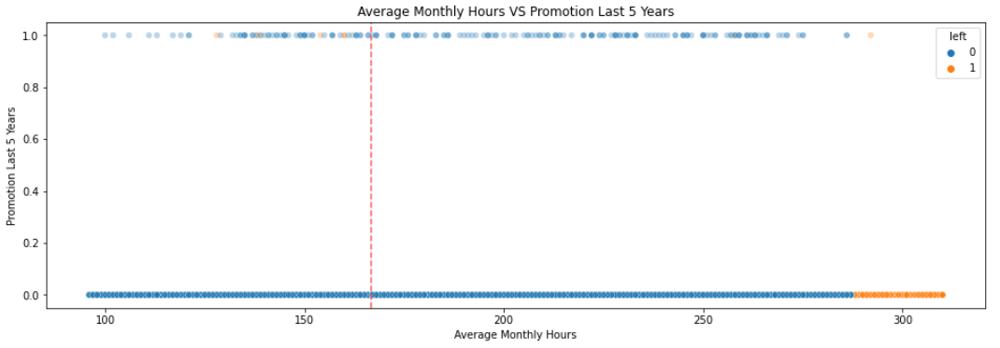
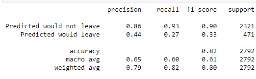

# Salifort-Motors-Employee-Retention-Prediction
predict employee retention at Salifort Motors

## Project Structure

- `dataset/`: Contains the dataset used for analysis and modeling.
- `notebooks/`: Jupyter notebooks for exploratory data analysis, feature engineering, and modeling.
- `images/`: Visualizations and plots generated during the analysis.

## Getting Started

1. **Clone the Repository:**
   ```bash
   git clone https://github.com/AyazRao/Salifort-Motors-Employee-Retention-Prediction.git
   cd Salifort-Motors-Employee-Retention-Prediction
   
## Description and Deliverables

This capstone project involves analyzing a dataset to build predictive models that offer insights to the Human Resources (HR) department of a large consulting firm, Salifort Motors. The deliverables include a one-page project summary for stakeholders and a complete code notebook. The project focuses on predicting whether an employee will leave the company.

# Pace:  Plan

### Understand the Business Scenario and Problem

The HR department aims to enhance employee satisfaction at Salifort Motors and seeks data-driven suggestions based on collected employee data. The project's goal is to analyze HR data and build a predictive model to identify employees likely to leave the company.

### Familiarize Yourself with the HR Dataset


### Load Dataset

The dataset "HR_capstone_dataset.csv" is loaded using Pandas.

### Data Exploration (Initial EDA and Data Cleaning)


- Tenure has outliers.
- Some employees work more than the maximum number of working hours.
- Lower Limit: 1.5, Upper Limit: 5.5.
- 824 recordings have tenure outliers.

- **What do you observe about the distributions in the data?**
  - **Satisfaction Level:**
    - The mean satisfaction level is approximately 0.613.
    - The distribution appears to be relatively symmetric, with values ranging from a minimum of 0.09 to a maximum of 1.00.
  - **Last Evaluation:**
    - The mean last evaluation score is around 0.716.
    - The distribution seems to be relatively symmetric, with values ranging from 0.36 to 1.00.
  - **Number of Projects:**
    - The mean number of projects is approximately 3.803.
    - The distribution indicates that most employees are involved in 3 to 5 projects, with a minimum of 2 and a maximum of 7.
  - **Average Monthly Hours:**
    - The mean average monthly hours worked is about 201.05.
    - The distribution suggests a range of hours worked, with a minimum of 96 hours and a maximum of 310 hours.
  - **Tenures:**
    - The mean time spent in the company is around 3.50 years.
    - The distribution shows most employees having a tenure between 2 to 4 years, with a minimum of 2 years and a maximum of 10 years.
    - There are 824 records with tenures considered as outliers, falling beyond the defined limits of Lower Limit: 1.5 and Upper Limit: 5.5.
  - **Work Accident:**
    - The distribution of work accidents is binary (0 or 1), indicating whether an employee experienced a work accident.
    - The mean suggests that work accidents are relatively infrequent, with a mean of approximately 0.145.
  - **Left (Employee Turnover):**
    - The turnover distribution is binary (0 or 1), indicating whether an employee left the company.
    - The mean implies that turnover is not extremely prevalent, with a mean of approximately 0.238.
  - **Promotion in the Last 5 Years:**
    - The distribution of promotions in the last 5 years is binary (0 or 1), indicating whether an employee was promoted.
    - The mean suggests that promotions are relatively rare, with a mean of approximately 0.021.

#### People who Left the Company
**Employees who left: 1991, Stayed: 100000.**
**Percentage left: 16.6%, Stayed: 83.4%.**

# pAce: Analyze Stage
- Perform EDA (analyze relationships between variables)

### Data visualizations





## Insights
The departure of employees seems to be correlated with issues in management, manifested through extended working hours, a high number of projects, and generally lower satisfaction levels. The lack of promotions and favorable evaluations for those putting in prolonged work hours likely contributes to a substantial group experiencing burnout. Interestingly, individuals who have spent more than six years at the company exhibit a tendency to stay rather than leave.

# paCe: Construct Stage

### Modeling

## Logistic Regression Model ##
binomial logistic regression suits the task because it involves binary classification.


1. Upper Left True negative 
- 2165 employees stayed and model also predicted them right 
2. Upper Right False positive
- 156 employee stayed and that is False 
3. Lower Left False negative
- 346 employees left and that is False
4. Lower Right True positive
- 125 employees left and model also predicted them right 



# pacE: Execute Stage


### Summary of model results

## **Logistic Regression**

The logistic regression model achieved precision of 79%, recall of 82%, f1-score of 80% (all weighted averages), and accuracy of 82%, on the test set.


### Conclusion, Recommendations, Next Steps

Models and feature importance analysis confirm employee overwork. To retain employees:

- Cap projects per employee.
- Promote those with 4+ years or investigate their dissatisfaction.
- Reward long hours or eliminate the requirement.
- Inform about overtime pay policies and clarify workload expectations.
- Conduct discussions to address overall work culture.
- Revise evaluation scales for proportional recognition.

### Next steps:

- Assess predictions without last_evaluation to address data leakage concerns.
- Explore predicting performance scores if evaluations impact retention.
- Consider the same approach for satisfaction scores.